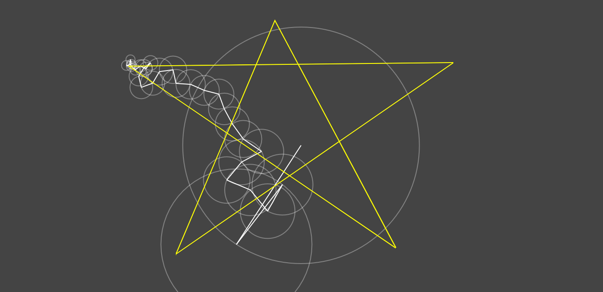

# Fourier

A TypeScript implementation of Fourier Series and Transform.



## 🎯 Features

- It uses the discrete Fourier transform method to calculate the circumferences properties.
- It uses native math tools.
- User can draw on the screen.

## 🔧 Installation

```bash
# Clone
$ git clone https://github.com/juanbelieni/fourier.git

# Move to folder
$ cd fourier

# Install with NPM
$ npm install
# or Yarn
$ yarn
```


## 🔭 Usage

```bash
# Run in development mode with NPM
$ npm run dev
# or Yarn
$ yarn dev

# Run in production mode, by building with NPM
$ yarn run build
# or Yarn
$ yarn build
# and serving
$ npx serve -s dist
```


## 📪 Contributing

1. Fork the Project
2. Create your Feature Branch: `git checkout -b feature/your-feature`
3. Commit your Changes: `git commit -m 'Add your-feature'`
4. Push to the Branch: `git push origin feature/your-feature`
5. Open a Pull Request

## ✉ Contact
Twitter: [@juanbelieni](https://twitter.com/juanbelieni) | Email: [juanbelieni@gmail.com](mailto:juanbelieni@gmail.com)

